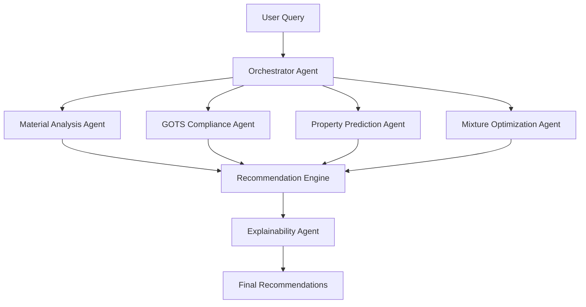

# Synthetic Plastic Transformer - AI Agents Documentation

## Overview

The Synthetic Plastic Transformer employs a multi-agent architecture where specialized AI agents collaborate to solve the complex problem of replacing synthetic polymers with natural fiber combinations. Each agent has a specific role and expertise, working together through a orchestrated pipeline.

## Agent Architecture



## Core Agents

### 1. Orchestrator Agent

**Purpose**: Coordinates the entire discovery pipeline and manages inter-agent communication.

**Responsibilities**:
- Parse user requirements and constraints
- Route queries to appropriate specialized agents
- Aggregate results from multiple agents
- Handle error recovery and fallback strategies

**Key Methods**:
```python
class OrchestratorAgent:
    def process_query(self, polymer_target, constraints):
        """Main entry point for material discovery requests"""
        
    def coordinate_agents(self, task_graph):
        """Manages agent execution order and dependencies"""
        
    def aggregate_results(self, agent_outputs):
        """Combines outputs from multiple agents"""
```

### 2. Material Analysis Agent

**Purpose**: Analyzes target polymer properties and identifies key characteristics that need to be matched.

**Responsibilities**:
- Decompose polymer properties into fundamental characteristics
- Identify critical performance metrics
- Map synthetic polymer features to natural fiber equivalents
- Access polymer databases (PolyInfo, PI1M, Khazana)

**Key Capabilities**:
- Chemical structure analysis
- Property correlation mapping
- Application-specific requirement extraction

### 3. Property Prediction Agent

**Purpose**: Uses transfer learning from protein folding models to predict material properties.

**Architecture**:
- **Base Model**: Pre-trained on protein folding data (AlphaFold-inspired)
- **Fine-tuning**: Adapted for polymer/fiber property prediction
- **Multi-head Output**: Separate prediction heads for different properties

**Predicted Properties**:
- Mechanical: tensile strength, elastic modulus, impact resistance
- Thermal: Tg, thermal conductivity, heat capacity
- Functional: water absorption, UV resistance, dielectric constant
- Environmental: biodegradability score, carbon footprint

**Transfer Learning Pipeline**:
```python
class PropertyPredictionAgent:
    def __init__(self, pretrained_model_path):
        self.encoder = ProteinFoldingEncoder(pretrained_model_path)
        self.property_heads = self._build_property_heads()
        
    def predict_properties(self, fiber_composition):
        """Predicts multiple properties simultaneously"""
        embeddings = self.encoder(fiber_composition)
        return {prop: head(embeddings) for prop, head in self.property_heads.items()}
```

### 4. GOTS Compliance Agent

**Purpose**: Ensures all recommendations meet Global Organic Textile Standard requirements.

**Validation Checks**:
- Fiber source certification (organic status)
- Processing temperature limits
- Chemical treatment compliance
- Minimum organic content (70% for "made with organic" label)
- Environmental impact thresholds

**Approved Fibers**:
- Cotton (organic)
- Wool (mulesing-free)
- Silk
- Hemp
- Flax/Linen
- Jute
- Kapok

**Processing Constraints**:
```python
GOTS_LIMITS = {
    'max_temperature': {
        'cotton': 150,
        'wool': 120,
        'silk': 110,
        'hemp': 160,
        'flax': 150,
        'jute': 140
    },
    'approved_chemicals': [
        'hydrogen_peroxide',
        'citric_acid',
        'natural_enzymes'
    ],
    'water_consumption': 100  # L/kg
}
```

### 5. Mixture Optimization Agent

**Purpose**: Determines optimal fiber blend ratios to achieve target properties.

**Optimization Strategy**:
- Multi-objective optimization using genetic algorithms
- Constraint satisfaction for GOTS compliance
- Synergistic effect modeling between fibers
- Cost-effectiveness balancing

**Key Features**:
- Handles non-linear fiber interactions
- Predicts processing compatibility
- Optimizes for multiple properties simultaneously
- Provides Pareto-optimal solutions

### 6. Explainability Agent

**Purpose**: Provides transparent explanations for all recommendations using Shapley values.

**Capabilities**:
- Feature importance analysis
- Contribution breakdown by fiber type
- Processing method justification
- Property trade-off visualization

**Output Format**:
```json
{
    "recommendation_id": "REC_001",
    "explanation": {
        "fiber_contributions": {
            "hemp_40%": {
                "tensile_strength": "+15 MPa",
                "water_absorption": "-2%",
                "cost": "+$0.5/kg"
            },
            "flax_35%": {
                "elastic_modulus": "+0.8 GPa",
                "thermal_stability": "+10°C",
                "biodegradability": "+15%"
            }
        },
        "processing_rationale": "Low-temperature enzymatic treatment selected to preserve fiber integrity while meeting GOTS requirements",
        "confidence_scores": {
            "property_match": 0.92,
            "gots_compliance": 1.0,
            "cost_effectiveness": 0.85
        }
    }
}
```

## Inter-Agent Communication

### Message Protocol

Agents communicate using a standardized message format:

```python
class AgentMessage:
    sender: str
    receiver: str
    message_type: str  # 'query', 'response', 'error'
    payload: dict
    timestamp: datetime
    priority: int
```

### Coordination Patterns

1. **Sequential Pipeline**: For standard material discovery queries
2. **Parallel Execution**: For independent property predictions
3. **Iterative Refinement**: For complex optimization scenarios
4. **Fallback Cascade**: For handling edge cases and errors

## Agent Training and Adaptation

### Continuous Learning

Each agent implements continuous learning mechanisms:

1. **Feedback Integration**: User validation of recommendations
2. **Database Updates**: New polymer/fiber data incorporation
3. **Transfer Learning Updates**: Periodic retraining with new data
4. **Performance Monitoring**: Track prediction accuracy over time

### Adaptation Strategies

```python
class AdaptiveAgent:
    def update_model(self, new_data, feedback):
        """Incrementally updates agent models with new information"""
        
    def detect_distribution_shift(self, current_data):
        """Identifies when input data differs from training distribution"""
        
    def request_human_intervention(self, uncertainty_threshold):
        """Escalates to human experts when confidence is low"""
```

## Performance Metrics

### Individual Agent Metrics

- **Material Analysis Agent**: Coverage of polymer types, feature extraction accuracy
- **Property Prediction Agent**: MAE/RMSE for each property, R² scores
- **GOTS Compliance Agent**: Compliance validation accuracy, false positive/negative rates
- **Mixture Optimization Agent**: Convergence speed, solution quality, diversity
- **Explainability Agent**: Explanation coherence, user satisfaction scores

### System-Level Metrics

- End-to-end recommendation accuracy
- Average response time
- Resource utilization
- User acceptance rate
- Environmental impact reduction

## Deployment Considerations

### Scalability

- Agents can be deployed as microservices
- Horizontal scaling for property prediction agents
- Caching for frequently requested polymers
- Batch processing for large-scale analysis

### Security and Privacy

- Encrypted inter-agent communication
- Access control for proprietary databases
- Audit logging for compliance tracking
- Data anonymization for user queries

## Future Enhancements

### Planned Agent Additions

1. **Supply Chain Agent**: Real-time fiber availability and pricing
2. **Lifecycle Analysis Agent**: Comprehensive environmental impact assessment
3. **Manufacturing Process Agent**: Detailed processing recommendations
4. **Quality Control Agent**: Predicts potential defects and quality issues

### Research Directions

- Multi-modal learning (combining molecular structures with process data)
- Reinforcement learning for optimization strategies
- Federated learning for proprietary data integration
- Quantum-inspired algorithms for complex property calculations

## Usage Examples

### Basic Material Discovery

```python
# Initialize the agent system
discovery_system = SyntheticPlasticTransformer()

# Query for HDPE replacement
result = discovery_system.orchestrator.process_query(
    polymer_target="HDPE",
    constraints={
        "application": "packaging",
        "min_tensile_strength": 25.0,  # MPa
        "max_water_absorption": 5.0,    # %
        "require_gots": True
    }
)
```

### Advanced Multi-Objective Optimization

```python
# Complex query with multiple objectives
result = discovery_system.orchestrator.process_query(
    polymer_target="PET",
    constraints={
        "application": "textiles",
        "objectives": {
            "maximize": ["tensile_strength", "uv_resistance"],
            "minimize": ["cost", "water_absorption"],
            "target": {"elastic_modulus": 2.5}  # GPa
        },
        "processing_limits": {
            "max_temperature": 140,
            "allowed_chemicals": ["natural_only"]
        }
    }
)
```

## Monitoring and Maintenance

### Health Checks

```python
# Agent health monitoring
health_status = discovery_system.get_agent_health()
for agent_name, status in health_status.items():
    print(f"{agent_name}: {status['state']} - "
          f"Uptime: {status['uptime']} - "
          f"Last Error: {status['last_error']}")
```

### Performance Dashboard

The system includes a real-time dashboard showing:
- Agent response times
- Prediction accuracy trends
- Resource utilization
- Queue depths and throughput
- Error rates and recovery status

## Conclusion

The multi-agent architecture of the Synthetic Plastic Transformer enables sophisticated material discovery through specialized, collaborative AI agents. This modular approach allows for continuous improvement, easy maintenance, and seamless integration of new capabilities as the field of sustainable materials evolves. 